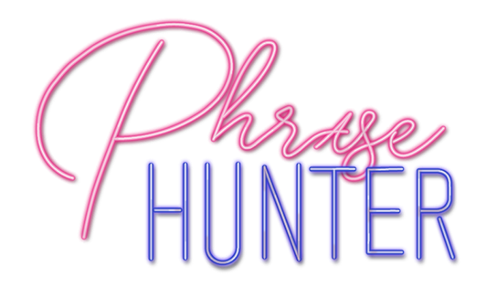

# Phrase Hunter
Created based on project from Teamtreehouse.com. 
HTML slightly altered, existing CSS code altered by adding media queries and enhancing flexbox layout to work on mobile devices, as well as creating a 'neon' button. 
Javascript created by me. 
If you are also student and  working on this or a similar project, feel free to reach out to me with anyquestions about this code. I've made an effort to include helpful comments anddocumentation for fellow learners. 

## Basic Structure

Phrase Hunter is a javascript based hangman type game. It features javascript animations and SVG graphics, created in Adobe Illustrator

### Concepts Demonstrated

The main technologies and concepts demonstrated in this project are

* javaScript: Object Oriented Programming
* Adobe Illustrator
* SVG Graphics
* Responsive Image Density 
* CSS Flexbox
* CSS Media Queries

## Logo


The 'Phrase Hunter' image is found in the repository as both a Scalable Vector Graphic and a PNG. In some cases, SVGs are smaller but in this case the complexity of the images makes the PNG a smaller sized option. 

Benefits of the SVG include:
* resizable without pixelation
* contains extra data like transparency and font information

Benefits of PNG the include
* often smaller file sizes for images with complex colors
* transparency in PNG-24 files
### Density and Resolution Switching
HTML enables different image resolutions depending on the pixel density of the display. 'Srcset' attribute allows browsers to select best image size, with 'src' as a fallback image. Since there is no art direction for different size devices, ```<picture>``` was not used
```
<!-- DENSITY AND RESOLUTION SWITCHING-->

```
### The typefaces used in the logo were:
The 'Phrase' text on the logo is based on 'Sidecar' by Fenotype -> https://fenotype.com/. The 'Hunter' text is loosely based on DIN Condensed, an Adobe Font ->https://fonts.adobe.com/. The Neon effect was created in Adobe Illustrator.

## CSS Queries
When implemented, images and details will be posted about: 

 * Media Queries for mobile/desktop
 * Dark/Light mode 

### Dark/Light Mode
| Dark| Light |
| --- | --- |
|  |  |

## Mobile/Desktop Query
| Mobile| Desktop |
| --- | --- |
|  |  |

* Note the button customized to match the typeface on hover. 

## Test Functionality

Visit https://aeronroemer.github.io/JS-Object-Oriented-Game/ to test the functionality of this project. 
